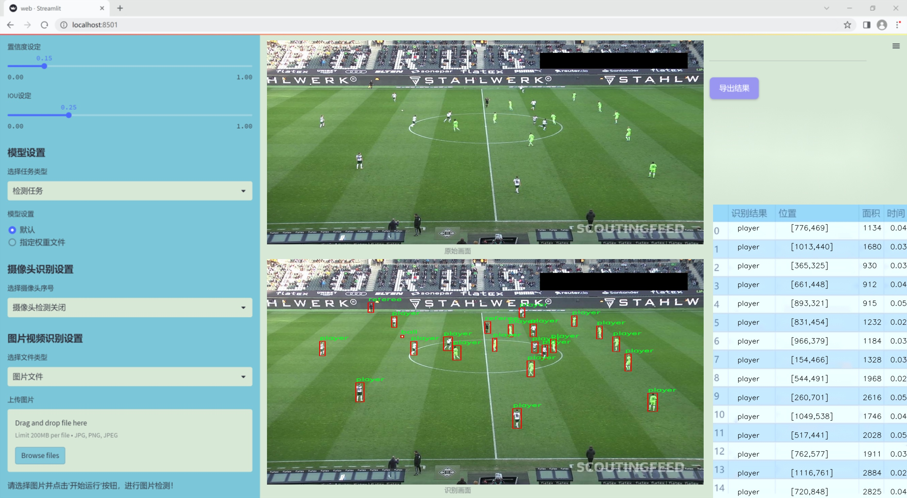
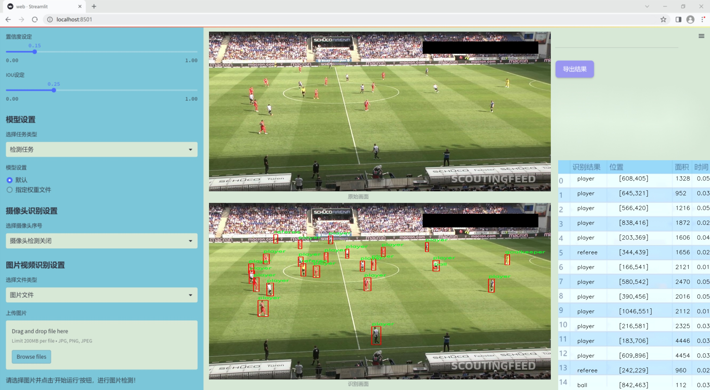
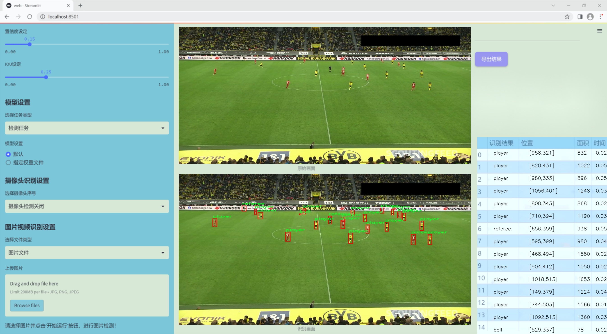
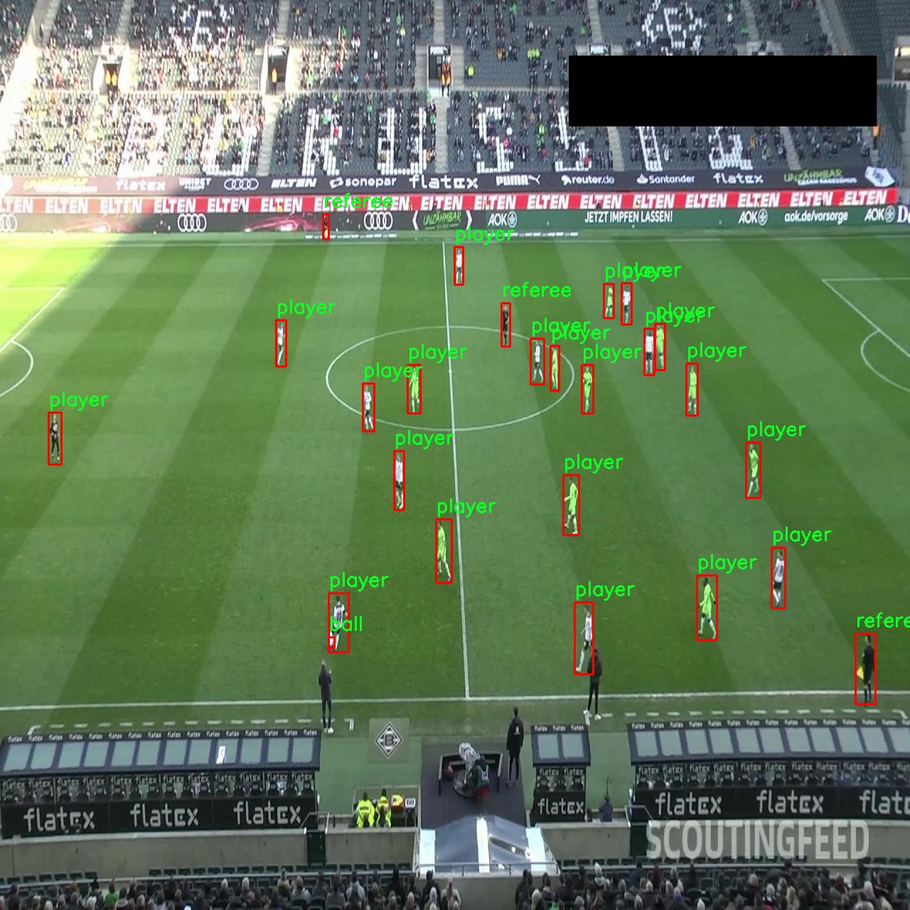
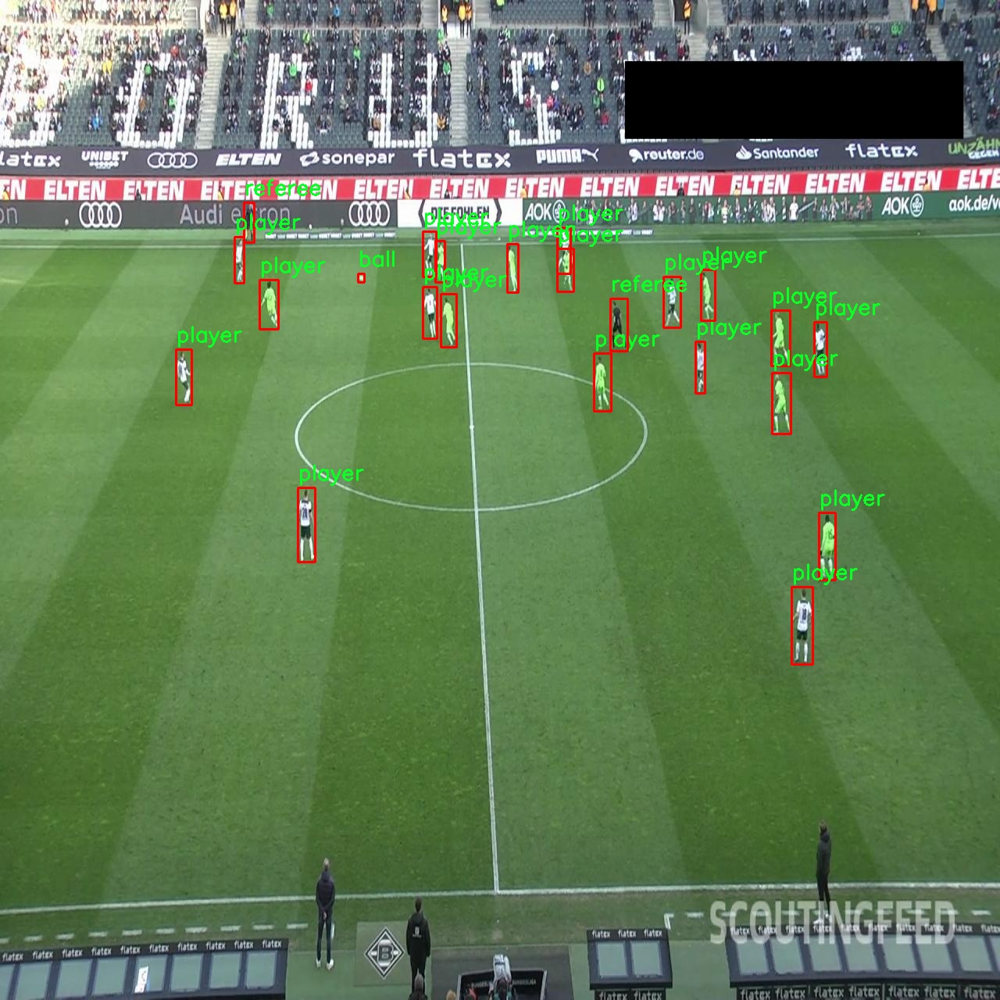
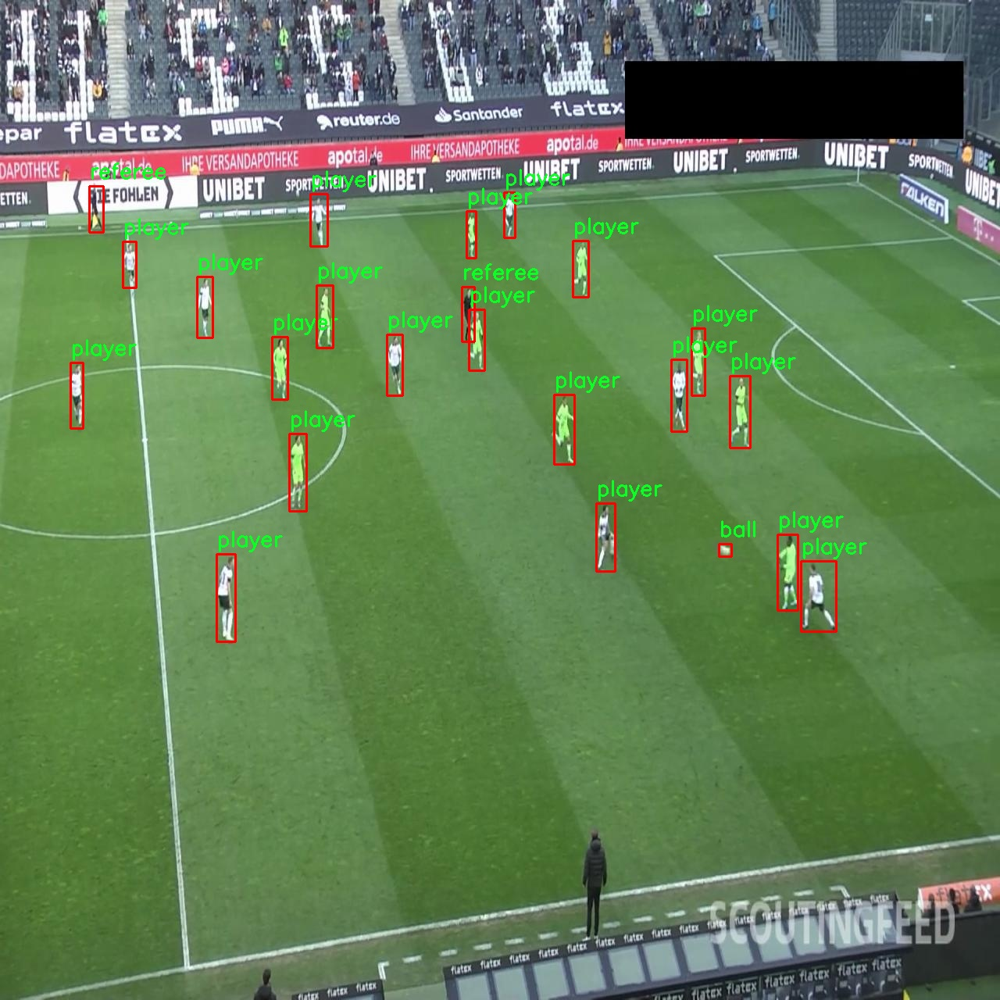
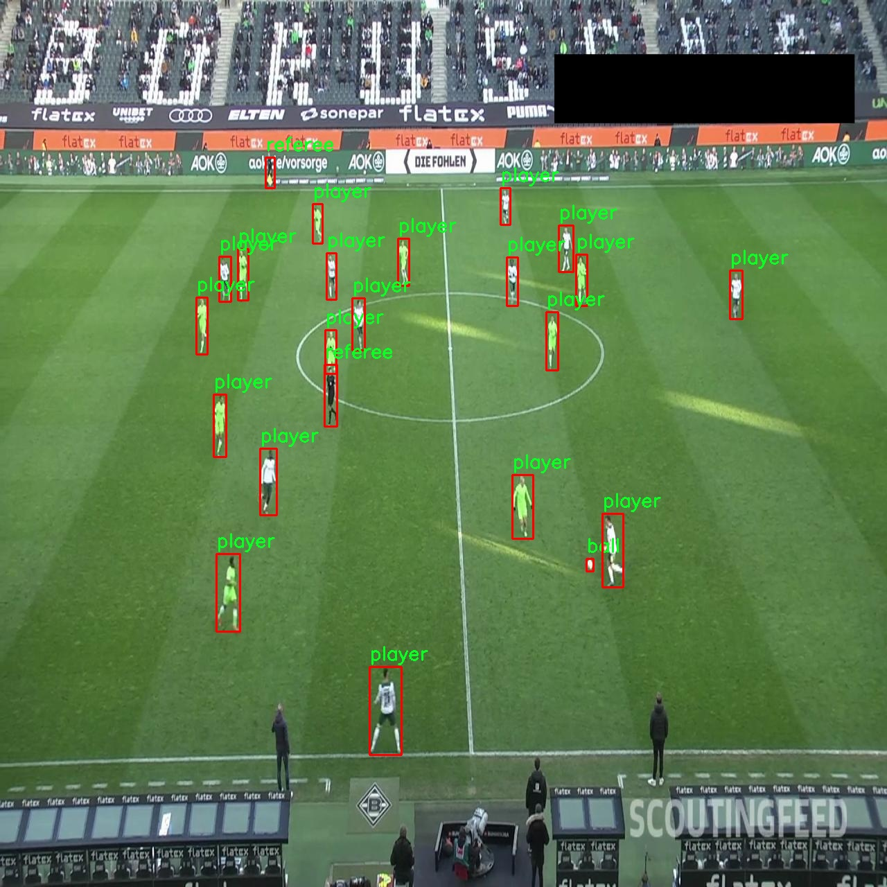
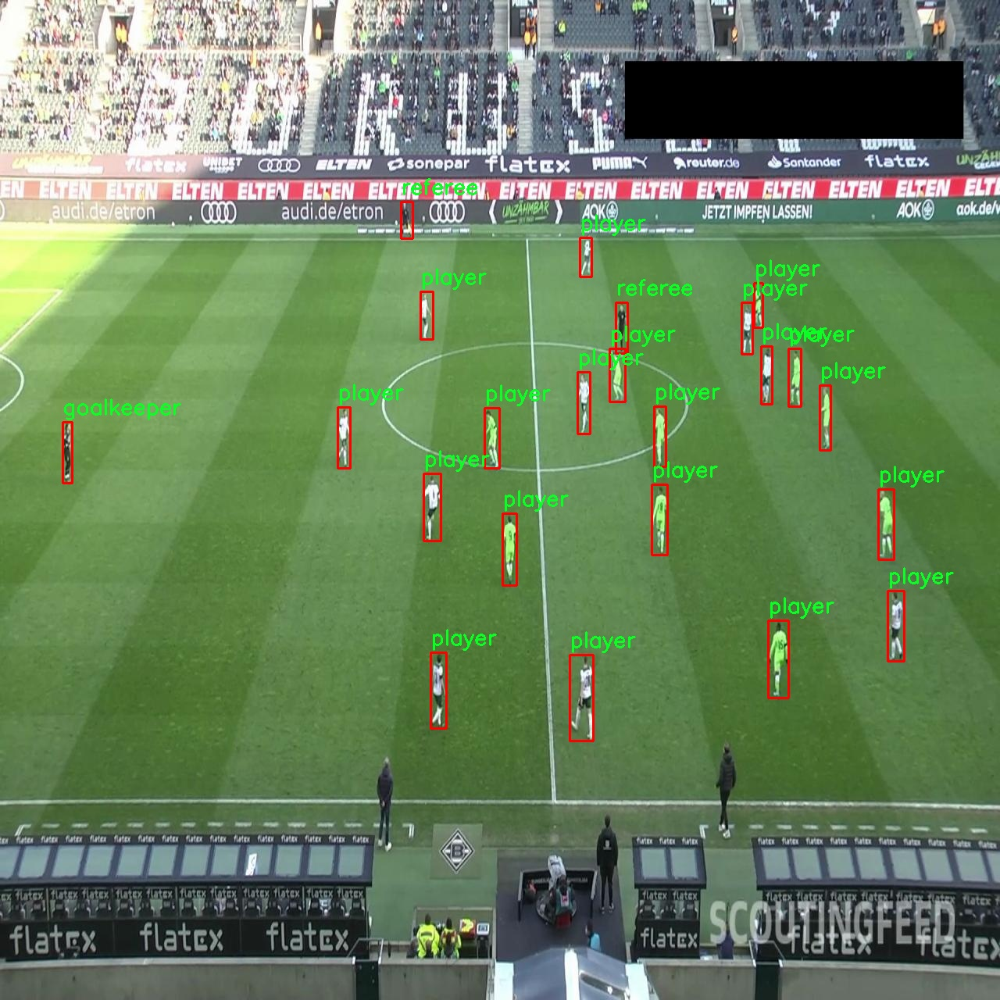

# 改进yolo11-FocalModulation等200+全套创新点大全：足球运动员球守门员裁判检测系统源码＆数据集全套

### 1.图片效果展示







##### 项目来源 **[人工智能促进会 2024.10.28](https://kdocs.cn/l/cszuIiCKVNis)**

注意：由于项目一直在更新迭代，上面“1.图片效果展示”和“2.视频效果展示”展示的系统图片或者视频可能为老版本，新版本在老版本的基础上升级如下：（实际效果以升级的新版本为准）

  （1）适配了YOLOV11的“目标检测”模型和“实例分割”模型，通过加载相应的权重（.pt）文件即可自适应加载模型。

  （2）支持“图片识别”、“视频识别”、“摄像头实时识别”三种识别模式。

  （3）支持“图片识别”、“视频识别”、“摄像头实时识别”三种识别结果保存导出，解决手动导出（容易卡顿出现爆内存）存在的问题，识别完自动保存结果并导出到tempDir中。

  （4）支持Web前端系统中的标题、背景图等自定义修改。

  另外本项目提供训练的数据集和训练教程,暂不提供权重文件（best.pt）,需要您按照教程进行训练后实现图片演示和Web前端界面演示的效果。

### 2.视频效果展示

[2.1 视频效果展示](https://www.bilibili.com/video/BV1MjSbYbEGx/)

### 3.背景

研究背景与意义

随着足球运动的普及和发展，足球比赛的裁判判罚和球员表现对比赛结果的影响愈发显著。因此，如何高效、准确地监测比赛中的关键角色——球员、守门员和裁判，成为了一个重要的研究课题。传统的人工监测方式不仅效率低下，而且容易受到主观因素的影响，导致判罚的公正性和准确性受到质疑。基于此，利用计算机视觉技术进行自动化检测显得尤为重要。

本研究旨在基于改进的YOLOv11模型，构建一个高效的足球运动员、守门员及裁判检测系统。YOLO（You Only Look Once）系列模型因其高效的实时检测能力而广泛应用于目标检测领域。相较于前几代模型，YOLOv11在精度和速度上都有了显著提升，能够在复杂的比赛环境中快速识别多个目标。通过对YOLOv11的改进，我们希望进一步提高模型在特定场景下的表现，尤其是在足球比赛中多目标的快速识别和分类。

本研究所使用的数据集包含372张图像，涵盖了9个类别，包括足球、守门员、球员和裁判等。这些数据的多样性和丰富性为模型的训练提供了良好的基础。通过对这些数据的深入分析和处理，我们将能够提高模型的泛化能力，使其在不同比赛场景下都能保持高效的检测性能。

综上所述，基于改进YOLOv11的足球运动员、守门员及裁判检测系统的研究，不仅有助于提升比赛的公正性和透明度，还能为未来的智能体育应用提供技术支持。随着技术的不断进步，这一系统的实现将为足球比赛的裁判工作提供有力的辅助工具，推动足球运动的进一步发展。

### 4.数据集信息展示

##### 4.1 本项目数据集详细数据（类别数＆类别名）

nc: 4
names: ['ball', 'goalkeeper', 'player', 'referee']


该项目为【目标检测】数据集，请在【训练教程和Web端加载模型教程（第三步）】这一步的时候按照【目标检测】部分的教程来训练

##### 4.2 本项目数据集信息介绍

本项目数据集信息介绍

本项目所使用的数据集名为“football-players-detection”，旨在为改进YOLOv11的足球运动员、守门员及裁判检测系统提供高质量的训练数据。该数据集包含四个主要类别，分别是“ball”（足球）、“goalkeeper”（守门员）、“player”（球员）和“referee”（裁判），这些类别的设置充分考虑了足球比赛中的关键角色与元素，为模型的训练提供了全面的场景覆盖。

在数据集的构建过程中，收集了大量的足球比赛图像，这些图像涵盖了不同的比赛场景、光照条件和角度，以确保模型能够在多样化的环境中进行有效的检测。每个类别的样本数量经过精心设计，以保证模型在训练时能够充分学习到每个类别的特征。例如，守门员和裁判在比赛中的动作和位置往往具有特定的模式，而球员和足球的动态变化则需要模型具备较强的时序感知能力。

数据集中的图像经过标注，确保每个类别的对象在图像中都被准确地框出。这些标注不仅包括对象的边界框信息，还涵盖了对象的类别标签，为后续的模型训练提供了必要的监督信号。此外，数据集还考虑到了不同球队的球衣颜色和样式，以提高模型对球员的识别能力，确保其在实际应用中能够准确区分不同的球员。

通过使用“football-players-detection”数据集，我们期望改进YOLOv11模型在足球场景中的检测精度和实时性，从而为足球比赛的分析、裁判辅助和观众体验提升提供有力支持。数据集的多样性和丰富性将为模型的训练打下坚实的基础，使其能够在复杂的比赛环境中表现出色。











### 5.全套项目环境部署视频教程（零基础手把手教学）

[5.1 所需软件PyCharm和Anaconda安装教程（第一步）](https://www.bilibili.com/video/BV1BoC1YCEKi/?spm_id_from=333.999.0.0&vd_source=bc9aec86d164b67a7004b996143742dc)


[5.2 安装Python虚拟环境创建和依赖库安装视频教程（第二步）](https://www.bilibili.com/video/BV1ZoC1YCEBw?spm_id_from=333.788.videopod.sections&vd_source=bc9aec86d164b67a7004b996143742dc)

### 6.改进YOLOv11训练教程和Web_UI前端加载模型教程（零基础手把手教学）

[6.1 改进YOLOv11训练教程和Web_UI前端加载模型教程（第三步）](https://www.bilibili.com/video/BV1BoC1YCEhR?spm_id_from=333.788.videopod.sections&vd_source=bc9aec86d164b67a7004b996143742dc)


按照上面的训练视频教程链接加载项目提供的数据集，运行train.py即可开始训练



     Epoch   gpu_mem       box       obj       cls    labels  img_size
     1/200     20.8G   0.01576   0.01955  0.007536        22      1280: 100%|██████████| 849/849 [14:42<00:00,  1.04s/it]
               Class     Images     Labels          P          R     mAP@.5 mAP@.5:.95: 100%|██████████| 213/213 [01:14<00:00,  2.87it/s]
                 all       3395      17314      0.994      0.957      0.0957      0.0843

     Epoch   gpu_mem       box       obj       cls    labels  img_size
     2/200     20.8G   0.01578   0.01923  0.007006        22      1280: 100%|██████████| 849/849 [14:44<00:00,  1.04s/it]
               Class     Images     Labels          P          R     mAP@.5 mAP@.5:.95: 100%|██████████| 213/213 [01:12<00:00,  2.95it/s]
                 all       3395      17314      0.996      0.956      0.0957      0.0845

     Epoch   gpu_mem       box       obj       cls    labels  img_size
     3/200     20.8G   0.01561    0.0191  0.006895        27      1280: 100%|██████████| 849/849 [10:56<00:00,  1.29it/s]
               Class     Images     Labels          P          R     mAP@.5 mAP@.5:.95: 100%|███████   | 187/213 [00:52<00:00,  4.04it/s]
                 all       3395      17314      0.996      0.957      0.0957      0.0845


###### [项目数据集下载链接](https://kdocs.cn/l/cszuIiCKVNis)

### 7.原始YOLOv11算法讲解

YOLOv11是一种由Ultralytics公司开发的最新一代目标检测模型，以其增强的特征提取能力和更高的效率在计算机视觉领域引人注目。该模型在架构上进行了关键升级，通过更新主干和颈部结构，显著提高了对复杂视觉场景的理解和处理精度。YOLOv11不仅在目标检测上表现出色，还支持实例分割、图像分类、姿态估计和定向目标检测（OBB）等任务，展示出其多功能性。

与其前身YOLOv8相比，YOLOv11在设计上实现了深度和宽度的改变，同时引入了几个创新机制。其中，C3k2机制是对YOLOv8中的C2f的改进，提升了浅层特征的处理能力；C2PSA机制则进一步优化了特征图的处理流程。解耦头的创新设计，通过增加两个深度卷积（DWConv），提高了模型对细节的感知能力和分类准确性。

在性能上，YOLOv11m模型在COCO数据集上的平均精度（mAP）提高，并减少了22%的参数量，确保了在运算效率上的突破。该模型可以部署在多种平台上，包括边缘设备、云平台以及支持NVIDIA GPU的系统，彰显出卓越的灵活性和适应性。总体而言，YOLOv11通过一系列的创新突破，对目标检测领域产生了深远的影响，并为未来的开发提供了新的研究方向。


****文档**** ： _ _https://docs.ultralytics.com/models/yolo11/__

****代码链接**** ： _ _https://github.com/ultralytics/ultralytics__

******Performance Metrics******


​ ** **关键特性****

****◆**** ** **增强的特征提取能力**** ：YOLO11采用了改进的主干和颈部架构，增强了 ** **特征提取****
能力，能够实现更精确的目标检测和复杂任务的执行。

****◆**** ** **优化的效率和速度****
：YOLO11引入了精细化的架构设计和优化的训练流程，提供更快的处理速度，并在准确性和性能之间保持最佳平衡。

****◆**** ** **参数更少、精度更高****
：通过模型设计的改进，YOLO11m在COCO数据集上实现了更高的平均精度（mAP），同时使用的参数比YOLOv8m少22%，使其在计算上更加高效，而不牺牲准确性。

****◆**** ** **跨环境的适应性**** ：YOLO11可以无缝部署在各种环境中，包括边缘设备、云平台和支持NVIDIA
GPU的系统，确保最大的灵活性。

****◆**** ** **支持广泛任务****
：无论是目标检测、实例分割、图像分类、姿态估计还是定向目标检测（OBB），YOLO11都旨在应对一系列计算机视觉挑战。

****支持的任务和模式****


​YOLO11建立在YOLOv8中引入的多功能模型范围之上，为各种计算机视觉任务提供增强的支持:


​该表提供了YOLO11模型变体的概述，展示了它们在特定任务中的适用性以及与Inference、Validation、Training和Export等操作模式的兼容性。从实时检测到复杂的分割任务
，这种灵活性使YOLO11适用于计算机视觉的广泛应用。

##### yolov11的创新

■ yolov8 VS yolov11

YOLOv5，YOLOv8和YOLOv11均是ultralytics公司的作品，ultralytics出品必属精品。


​ **具体创新点** ：

**① 深度（depth）和宽度 （width）**

YOLOv8和YOLOv11是基本上完全不同。

**② C3k2机制**

C3k2有参数为c3k，其中在网络的浅层c3k设置为False。C3k2就相当于YOLOv8中的C2f。


​ **③ C2PSA机制**

下图为C2PSA机制的原理图。


​ **④ 解耦头**

解耦头中的分类检测头增加了两个 **DWConv** 。


▲Conv

    
    
    def autopad(k, p=None, d=1):  # kernel, padding, dilation
    
        """Pad to 'same' shape outputs."""
    
        if d > 1:
    
            k = d * (k - 1) + 1 if isinstance(k, int) else [d * (x - 1) + 1 for x in k]  # actual kernel-size
    
        if p is None:
    
            p = k // 2 if isinstance(k, int) else [x // 2 for x in k]  # auto-pad
    
    return p
    
    
    class Conv(nn.Module):
    
        """Standard convolution with args(ch_in, ch_out, kernel, stride, padding, groups, dilation, activation)."""
    
    
        default_act = nn.SiLU()  # default activation
    
    
        def __init__(self, c1, c2, k=1, s=1, p=None, g=1, d=1, act=True):
    
            """Initialize Conv layer with given arguments including activation."""
    
            super().__init__()
    
            self.conv = nn.Conv2d(c1, c2, k, s, autopad(k, p, d), groups=g, dilation=d, bias=False)
    
            self.bn = nn.BatchNorm2d(c2)
    
            self.act = self.default_act if act is True else act if isinstance(act, nn.Module) else nn.Identity()
    
    
        def forward(self, x):
    
            """Apply convolution, batch normalization and activation to input tensor."""
    
            return self.act(self.bn(self.conv(x)))
    
    
        def forward_fuse(self, x):
    
            """Perform transposed convolution of 2D data."""
    
            return self.act(self.conv(x))

▲Conv2d

    
    
    torch.nn.Conv2d(in_channels, out_channels, kernel_size, stride=1, padding=0, dilation=1, groups=1, bias=True, padding_mode='zeros')

▲DWConv

DWConv ** **代表 Depthwise Convolution（深度卷积）****
，是一种在卷积神经网络中常用的高效卷积操作。它主要用于减少计算复杂度和参数量。

    
    
    class DWConv(Conv):
    
        """Depth-wise convolution."""
    
    
        def __init__(self, c1, c2, k=1, s=1, d=1, act=True):  # ch_in, ch_out, kernel, stride, dilation, activation
    
            """Initialize Depth-wise convolution with given parameters."""
    
            super().__init__(c1, c2, k, s, g=math.gcd(c1, c2), d=d, act=act)


### 8.200+种全套改进YOLOV11创新点原理讲解

#### 8.1 200+种全套改进YOLOV11创新点原理讲解大全

由于篇幅限制，每个创新点的具体原理讲解就不全部展开，具体见下列网址中的改进模块对应项目的技术原理博客网址【Blog】（创新点均为模块化搭建，原理适配YOLOv5~YOLOv11等各种版本）

[改进模块技术原理博客【Blog】网址链接](https://gitee.com/qunmasj/good)


#### 8.2 精选部分改进YOLOV11创新点原理讲解

###### 这里节选部分改进创新点展开原理讲解(完整的改进原理见上图和[改进模块技术原理博客链接](https://gitee.com/qunmasj/good)【如果此小节的图加载失败可以通过CSDN或者Github搜索该博客的标题访问原始博客，原始博客图片显示正常】

### MS-Block简介
实时目标检测，以YOLO系列为例，已在工业领域中找到重要应用，特别是在边缘设备（如无人机和机器人）中。与之前的目标检测器不同，实时目标检测器旨在在速度和准确性之间追求最佳平衡。为了实现这一目标，提出了大量的工作：从第一代DarkNet到CSPNet，再到最近的扩展ELAN，随着性能的快速增长，实时目标检测器的架构经历了巨大的变化。

尽管性能令人印象深刻，但在不同尺度上识别对象仍然是实时目标检测器面临的基本挑战。这促使作者设计了一个强大的编码器架构，用于学习具有表现力的多尺度特征表示。具体而言，作者从两个新的角度考虑为实时目标检测编码多尺度特征：

从局部视角出发，作者设计了一个具有简单而有效的分层特征融合策略的MS-Block。受到Res2Net的启发，作者在MS-Block中引入了多个分支来进行特征提取，但不同的是，作者使用了一个带有深度卷积的 Inverted Bottleneck Block块，以实现对大Kernel的高效利用。

从全局视角出发，作者提出随着网络加深逐渐增加卷积的Kernel-Size。作者在浅层使用小Kernel卷积来更高效地处理高分辨率特征。另一方面，在深层中，作者采用大Kernel卷积来捕捉广泛的信息。

基于以上设计原则，作者呈现了作者的实时目标检测器，称为YOLO-MS。为了评估作者的YOLO-MS的性能，作者在MS COCO数据集上进行了全面的实验。还提供了与其他最先进方法的定量比较，以展示作者方法的强大性能。如图1所示，YOLO-MS在计算性能平衡方面优于其他近期的实时目标检测器。


具体而言，YOLO-MS-XS在MS COCO上获得了43%+的AP得分，仅具有450万个可学习参数和8.7亿个FLOPs。YOLO-MS-S和YOLO-MS分别获得了46%+和51%+的AP，可学习参数分别为810万和2220万。此外，作者的工作还可以作为其他YOLO模型的即插即用模块。通常情况下，作者的方法可以将YOLOv11的AP从37%+显著提高到40%+，甚至还可以使用更少的参数和FLOPs。

CSP Block是一个基于阶段级梯度路径的网络，平衡了梯度组合和计算成本。它是广泛应用于YOLO系列的基本构建块。已经提出了几种变体，包括YOLOv4和YOLOv11中的原始版本，Scaled YOLOv4中的CSPVoVNet，YOLOv11中的ELAN，以及RTMDet中提出的大Kernel单元。作者在图2(a)和图2(b)中分别展示了原始CSP块和ELAN的结构。


上述实时检测器中被忽视的一个关键方面是如何在基本构建块中编码多尺度特征。其中一个强大的设计原则是Res2Net，它聚合了来自不同层次的特征以增强多尺度表示。然而，这一原则并没有充分探索大Kernel卷积的作用，而大Kernel卷积已经在基于CNN的视觉识别任务模型中证明有效。将大Kernel卷积纳入Res2Net的主要障碍在于它们引入的计算开销，因为构建块采用了标准卷积。在作者的方法中，作者提出用 Inverted Bottleneck Block替代标准的3 × 3卷积，以享受大Kernel卷积的好处。

#### MS-Block

基于前面的分析，参考该博客提出了一个带有分层特征融合策略的全新Block，称为MS-Block，以增强实时目标检测器在提取多尺度特征时的能力，同时保持快速的推理速度。

MS-Block的具体结构如图2(c)所示。假设是输入特征。通过1×1卷积的转换后，X的通道维度增加到n*C。然后，作者将X分割成n个不同的组，表示为，其中。为了降低计算成本，作者选择n为3。

注意，除了之外，每个其他组都经过一个 Inverted Bottleneck Block层，用表示，其中k表示Kernel-Size，以获得。的数学表示如下：


根据这个公式，作者不将 Inverted Bottleneck Block层连接到，使其作为跨阶段连接，并保留来自前面层的信息。最后，作者将所有分割连接在一起，并应用1×1卷积来在所有分割之间进行交互，每个分割都编码不同尺度的特征。当网络加深时，这个1×1卷积也用于调整通道数。

#### Heterogeneous Kernel Selection Protocol
除了构建块的设计外，作者还从宏观角度探讨了卷积的使用。之前的实时目标检测器在不同的编码器阶段采用了同质卷积（即具有相同Kernel-Size的卷积），但作者认为这不是提取多尺度语义信息的最佳选项。

在金字塔结构中，从检测器的浅阶段提取的高分辨率特征通常用于捕捉细粒度语义，将用于检测小目标。相反，来自网络较深阶段的低分辨率特征用于捕捉高级语义，将用于检测大目标。如果作者在所有阶段都采用统一的小Kernel卷积，深阶段的有效感受野（ERF）将受到限制，影响大目标的性能。在每个阶段中引入大Kernel卷积可以帮助解决这个问题。然而，具有大的ERF的大Kernel可以编码更广泛的区域，这增加了在小目标外部包含噪声信息的概率，并且降低了推理速度。

在这项工作中，作者建议在不同阶段中采用异构卷积，以帮助捕获更丰富的多尺度特征。具体来说，在编码器的第一个阶段中，作者采用最小Kernel卷积，而最大Kernel卷积位于最后一个阶段。随后，作者逐步增加中间阶段的Kernel-Size，使其与特征分辨率的增加保持一致。这种策略允许提取细粒度和粗粒度的语义信息，增强了编码器的多尺度特征表示能力。

正如图所示，作者将k的值分别分配给编码器中的浅阶段到深阶段，取值为3、5、7和9。作者将其称为异构Kernel选择（HKS）协议。


作者的HKS协议能够在深层中扩大感受野，而不会对浅层产生任何其他影响。第4节的图4支持了作者的分析。此外，HKS不仅有助于编码更丰富的多尺度特征，还确保了高效的推理。

如表1所示，将大Kernel卷积应用于高分辨率特征会产生较高的计算开销。然而，作者的HKS协议在低分辨率特征上采用大Kernel卷积，从而与仅使用大Kernel卷积相比，大大降低了计算成本。


在实践中，作者经验性地发现，采用HKS协议的YOLO-MS的推理速度几乎与仅使用深度可分离的3 × 3卷积相同。


如图所示，作者模型的Backbone由4个阶段组成，每个阶段后面跟随1个步长为2的3 × 3卷积进行下采样。在第3个阶段后，作者添加了1个SPP块，与RTMDet中一样。在作者的编码器上，作者使用PAFPN作为Neck来构建特征金字塔[31, 35]。它融合了从Backbone不同阶段提取的多尺度特征。Neck中使用的基本构建块也是作者的MS-Block，在其中使用3 × 3深度可分离卷积进行快速推理。

此外，为了在速度和准确性之间取得更好的平衡，作者将Backbone中多级特征的通道深度减半。作者提供了3个不同尺度的YOLO-MS变体，即YOLO-MS-XS、YOLO-MS-S和YOLO-MS。不同尺度的YOLO-MS的详细配置列在表2中。对于YOLO-MS的其他部分，作者将其保持与RTMDet相同。


### 9.系统功能展示

图9.1.系统支持检测结果表格显示

  图9.2.系统支持置信度和IOU阈值手动调节

  图9.3.系统支持自定义加载权重文件best.pt(需要你通过步骤5中训练获得)

  图9.4.系统支持摄像头实时识别

  图9.5.系统支持图片识别

  图9.6.系统支持视频识别

  图9.7.系统支持识别结果文件自动保存

  图9.8.系统支持Excel导出检测结果数据


### 10. YOLOv11核心改进源码讲解

#### 10.1 rep_block.py

以下是经过简化和注释的核心代码部分，主要集中在 `DiverseBranchBlock` 类及其相关的功能函数上。这些部分实现了多分支卷积块的核心逻辑，包括卷积、批归一化、以及不同分支的融合。

```python
import torch
import torch.nn as nn
import torch.nn.functional as F

def transI_fusebn(kernel, bn):
    """
    将卷积核和批归一化层的参数融合为一个卷积层的参数。
    :param kernel: 卷积核
    :param bn: 批归一化层
    :return: 融合后的卷积核和偏置
    """
    gamma = bn.weight  # 获取批归一化的缩放因子
    std = (bn.running_var + bn.eps).sqrt()  # 计算标准差
    # 返回融合后的卷积核和偏置
    return kernel * ((gamma / std).reshape(-1, 1, 1, 1)), bn.bias - bn.running_mean * gamma / std

def conv_bn(in_channels, out_channels, kernel_size, stride=1, padding=0, dilation=1, groups=1):
    """
    创建一个卷积层和批归一化层的组合。
    :param in_channels: 输入通道数
    :param out_channels: 输出通道数
    :param kernel_size: 卷积核大小
    :param stride: 步幅
    :param padding: 填充
    :param dilation: 膨胀
    :param groups: 分组卷积
    :return: 包含卷积和批归一化的序列
    """
    conv_layer = nn.Conv2d(in_channels, out_channels, kernel_size, stride=stride, padding=padding, dilation=dilation, groups=groups, bias=False)
    bn_layer = nn.BatchNorm2d(num_features=out_channels, affine=True)
    return nn.Sequential(conv_layer, bn_layer)

class DiverseBranchBlock(nn.Module):
    def __init__(self, in_channels, out_channels, kernel_size, stride=1, padding=None, dilation=1, groups=1):
        """
        多分支卷积块的构造函数。
        :param in_channels: 输入通道数
        :param out_channels: 输出通道数
        :param kernel_size: 卷积核大小
        :param stride: 步幅
        :param padding: 填充
        :param dilation: 膨胀
        :param groups: 分组卷积
        """
        super(DiverseBranchBlock, self).__init__()
        
        if padding is None:
            padding = kernel_size // 2  # 默认填充为卷积核大小的一半
        
        # 原始卷积和批归一化
        self.dbb_origin = conv_bn(in_channels, out_channels, kernel_size, stride, padding, dilation, groups)
        
        # 平均池化分支
        self.dbb_avg = nn.Sequential(
            nn.Conv2d(in_channels, out_channels, kernel_size=1, stride=1, padding=0, groups=groups, bias=False),
            nn.BatchNorm2d(out_channels),
            nn.AvgPool2d(kernel_size=kernel_size, stride=stride, padding=0)
        )

        # 1x1 卷积分支
        self.dbb_1x1_kxk = nn.Sequential(
            nn.Conv2d(in_channels, out_channels, kernel_size=1, stride=1, padding=0, groups=groups, bias=False),
            nn.BatchNorm2d(out_channels)
        )

    def forward(self, inputs):
        """
        前向传播函数。
        :param inputs: 输入张量
        :return: 输出张量
        """
        out = self.dbb_origin(inputs)  # 原始卷积分支
        out += self.dbb_avg(inputs)     # 平均池化分支
        out += self.dbb_1x1_kxk(inputs) # 1x1 卷积分支
        return out  # 返回最终输出

# 其他类和函数可以根据需要进行类似的简化和注释
```

### 代码说明：
1. **transI_fusebn**: 该函数将卷积层和批归一化层的参数融合，返回融合后的卷积核和偏置。
2. **conv_bn**: 创建一个包含卷积层和批归一化层的序列，便于构建网络结构。
3. **DiverseBranchBlock**: 这是多分支卷积块的核心类，包含多个分支（原始卷积、平均池化和1x1卷积），并在前向传播中将它们的输出相加。

### 注意事项：
- 代码中的其他部分（如不同的转换函数和其他分支）可以根据具体需求进行进一步的简化和注释。
- 在实际应用中，可能需要根据具体的网络架构和任务需求进行调整。

这个文件 `rep_block.py` 是一个实现了多种卷积块的 PyTorch 模块，主要用于深度学习中的卷积神经网络（CNN）。文件中定义了多个类和函数，旨在提供不同类型的卷积块，包括多分支卷积块和宽卷积块等。

首先，文件中导入了必要的库，包括 PyTorch 的核心库和一些常用的功能模块。接着，定义了一些辅助函数，这些函数主要用于处理卷积核和偏置的转换，特别是在与批归一化（Batch Normalization）结合时的处理。这些函数的功能包括将卷积核与批归一化参数融合、将多个卷积核和偏置相加、以及处理不同尺寸的卷积核等。

接下来，定义了几个主要的卷积块类。`DiverseBranchBlock` 是一个多分支卷积块，支持多种卷积操作，包括常规卷积、1x1 卷积和平均池化等。这个类的构造函数中，根据输入的参数初始化不同的卷积层和批归一化层。它还提供了一个 `get_equivalent_kernel_bias` 方法，用于获取等效的卷积核和偏置，以便在推理阶段使用。

`DiverseBranchBlockNOAct` 类是一个类似的卷积块，但不包含非线性激活函数。这使得它在某些情况下更灵活，特别是在需要将其与其他层组合时。

`DeepDiverseBranchBlock` 类则是一个更深层次的多分支卷积块，继承了 `DiverseBranchBlockNOAct`，并在此基础上增加了更多的功能。它的构造函数允许更复杂的结构，并且提供了与 `DiverseBranchBlock` 类似的功能。

`WideDiverseBranchBlock` 类实现了宽卷积块，特别适用于处理具有不同宽度和高度的输入数据。它包含了水平和垂直卷积的实现，并通过 `_add_to_square_kernel` 方法将这些卷积核合并到一个方形卷积核中。

每个类都实现了 `forward` 方法，定义了前向传播的逻辑。在推理阶段，类会根据是否处于部署模式（`deploy`）来选择使用预先计算的卷积核和偏置，或者执行实际的卷积操作。

此外，文件中还包含了一些初始化方法，用于设置批归一化层的权重和偏置，确保在训练过程中能够得到合适的参数。

总体来说，这个文件提供了一种灵活的方式来构建和使用多种类型的卷积块，适用于不同的深度学习任务，尤其是在图像处理和计算机视觉领域。通过这些模块，用户可以轻松地构建复杂的神经网络架构，并进行高效的训练和推理。

#### 10.2 kan_conv.py

以下是经过简化和注释的核心代码部分：

```python
import torch
import torch.nn as nn

class KANConvNDLayer(nn.Module):
    def __init__(self, conv_class, norm_class, input_dim, output_dim, spline_order, kernel_size,
                 groups=1, padding=0, stride=1, dilation=1,
                 ndim: int = 2, grid_size=5, base_activation=nn.GELU, grid_range=[-1, 1], dropout=0.0):
        super(KANConvNDLayer, self).__init__()
        
        # 初始化参数
        self.inputdim = input_dim  # 输入维度
        self.outdim = output_dim    # 输出维度
        self.spline_order = spline_order  # 样条阶数
        self.kernel_size = kernel_size  # 卷积核大小
        self.padding = padding  # 填充
        self.stride = stride  # 步幅
        self.dilation = dilation  # 膨胀
        self.groups = groups  # 分组数
        self.ndim = ndim  # 维度
        self.grid_size = grid_size  # 网格大小
        self.base_activation = base_activation()  # 基础激活函数
        self.grid_range = grid_range  # 网格范围

        # 初始化 dropout
        self.dropout = None
        if dropout > 0:
            if ndim == 1:
                self.dropout = nn.Dropout1d(p=dropout)
            elif ndim == 2:
                self.dropout = nn.Dropout2d(p=dropout)
            elif ndim == 3:
                self.dropout = nn.Dropout3d(p=dropout)

        # 验证 groups 参数
        if groups <= 0:
            raise ValueError('groups must be a positive integer')
        if input_dim % groups != 0:
            raise ValueError('input_dim must be divisible by groups')
        if output_dim % groups != 0:
            raise ValueError('output_dim must be divisible by groups')

        # 创建基础卷积层和样条卷积层
        self.base_conv = nn.ModuleList([conv_class(input_dim // groups,
                                                   output_dim // groups,
                                                   kernel_size,
                                                   stride,
                                                   padding,
                                                   dilation,
                                                   groups=1,
                                                   bias=False) for _ in range(groups)])

        self.spline_conv = nn.ModuleList([conv_class((grid_size + spline_order) * input_dim // groups,
                                                     output_dim // groups,
                                                     kernel_size,
                                                     stride,
                                                     padding,
                                                     dilation,
                                                     groups=1,
                                                     bias=False) for _ in range(groups)])

        # 创建归一化层和激活层
        self.layer_norm = nn.ModuleList([norm_class(output_dim // groups) for _ in range(groups)])
        self.prelus = nn.ModuleList([nn.PReLU() for _ in range(groups)])

        # 初始化网格
        h = (self.grid_range[1] - self.grid_range[0]) / grid_size
        self.grid = torch.linspace(
            self.grid_range[0] - h * spline_order,
            self.grid_range[1] + h * spline_order,
            grid_size + 2 * spline_order + 1,
            dtype=torch.float32
        )

        # 使用 Kaiming 均匀分布初始化卷积层权重
        for conv_layer in self.base_conv:
            nn.init.kaiming_uniform_(conv_layer.weight, nonlinearity='linear')

        for conv_layer in self.spline_conv:
            nn.init.kaiming_uniform_(conv_layer.weight, nonlinearity='linear')

    def forward_kan(self, x, group_index):
        # 对输入应用基础激活函数并进行线性变换
        base_output = self.base_conv[group_index](self.base_activation(x))

        # 扩展维度以进行样条操作
        x_uns = x.unsqueeze(-1)
        target = x.shape[1:] + self.grid.shape
        grid = self.grid.view(*list([1 for _ in range(self.ndim + 1)] + [-1, ])).expand(target).contiguous().to(x.device)

        # 计算样条基
        bases = ((x_uns >= grid[..., :-1]) & (x_uns < grid[..., 1:])).to(x.dtype)

        # 计算多阶样条基
        for k in range(1, self.spline_order + 1):
            left_intervals = grid[..., :-(k + 1)]
            right_intervals = grid[..., k:-1]
            delta = torch.where(right_intervals == left_intervals, torch.ones_like(right_intervals),
                                right_intervals - left_intervals)
            bases = ((x_uns - left_intervals) / delta * bases[..., :-1]) + \
                    ((grid[..., k + 1:] - x_uns) / (grid[..., k + 1:] - grid[..., 1:(-k)]) * bases[..., 1:])
        bases = bases.contiguous()
        bases = bases.moveaxis(-1, 2).flatten(1, 2)

        # 通过样条卷积层处理样条基
        spline_output = self.spline_conv[group_index](bases)
        x = self.prelus[group_index](self.layer_norm[group_index](base_output + spline_output))

        # 应用 dropout
        if self.dropout is not None:
            x = self.dropout(x)

        return x

    def forward(self, x):
        # 将输入按组分割
        split_x = torch.split(x, self.inputdim // self.groups, dim=1)
        output = []
        for group_ind, _x in enumerate(split_x):
            y = self.forward_kan(_x.clone(), group_ind)
            output.append(y.clone())
        y = torch.cat(output, dim=1)  # 合并输出
        return y
```

### 代码说明：
1. **类定义**：`KANConvNDLayer` 是一个自定义的神经网络层，支持多维卷积操作。
2. **初始化方法**：`__init__` 方法中定义了层的各种参数，包括输入输出维度、卷积参数、激活函数等，并初始化了卷积层、归一化层和激活层。
3. **前向传播**：`forward_kan` 方法实现了前向传播的具体逻辑，包括基础卷积、样条基的计算和最终输出的生成。
4. **分组处理**：`forward` 方法将输入数据按组分割，并对每个组应用 `forward_kan` 方法，最后将结果合并。

这个程序文件定义了一个名为 `KANConvNDLayer` 的神经网络层，主要用于实现一种基于样条插值的卷积操作。它是一个可扩展的类，支持一维、二维和三维卷积，分别通过 `KANConv1DLayer`、`KANConv2DLayer` 和 `KANConv3DLayer` 进行具体实现。

在 `KANConvNDLayer` 的构造函数中，初始化了一系列参数，包括输入和输出维度、卷积核大小、样条阶数、分组数、填充、步幅、扩张、网格大小、基础激活函数、网格范围以及 dropout 概率。构造函数首先进行了一些参数的合法性检查，例如分组数必须为正整数，输入和输出维度必须能够被分组数整除。

接下来，构造了基础卷积层和样条卷积层，分别使用 `conv_class` 作为卷积操作的实现类，并将其存储在 `ModuleList` 中，以便于后续的使用。基础卷积层的权重使用 Kaiming 均匀分布进行初始化，以便于更好的训练开始。

在 `forward_kan` 方法中，首先对输入进行基础激活，然后通过基础卷积层进行线性变换。接着，计算样条基函数，通过将输入扩展维度来进行样条操作。计算过程中使用了输入值与网格的关系来生成样条基，最后通过样条卷积层进行卷积操作，并与基础卷积的输出相加。经过层归一化和激活函数处理后，最终的输出可以选择性地应用 dropout。

`forward` 方法负责将输入数据按组进行拆分，并对每一组调用 `forward_kan` 方法进行处理，最后将所有组的输出拼接在一起，形成最终的输出。

`KANConv3DLayer`、`KANConv2DLayer` 和 `KANConv1DLayer` 类分别继承自 `KANConvNDLayer`，并在初始化时指定相应的卷积类和归一化类，以实现三维、二维和一维卷积的功能。这种设计使得代码具有很好的可扩展性和复用性，可以方便地在不同维度的卷积操作中使用相同的基本逻辑。

#### 10.3 test_selective_scan_easy.py

以下是保留的核心代码部分，并附上详细的中文注释：

```python
import torch

def selective_scan_easy(us, dts, As, Bs, Cs, Ds, delta_bias=None, delta_softplus=False, return_last_state=False, chunksize=64):
    """
    选择性扫描函数
    参数:
    us: 输入张量，形状为 (B, G * D, L)
    dts: 时间增量张量，形状为 (B, G * D, L)
    As: 权重矩阵，形状为 (G * D, N)
    Bs: 权重矩阵，形状为 (B, G, N, L)
    Cs: 权重矩阵，形状为 (B, G, N, L)
    Ds: 偏置张量，形状为 (G * D)
    delta_bias: 可选的偏置调整
    delta_softplus: 是否应用softplus函数
    return_last_state: 是否返回最后的状态
    chunksize: 每次处理的块大小
    """
    
    def selective_scan_chunk(us, dts, As, Bs, Cs, hprefix):
        """
        处理单个块的选择性扫描
        参数:
        us: 输入张量块
        dts: 时间增量块
        As, Bs, Cs: 权重矩阵
        hprefix: 前一个状态
        返回:
        ys: 输出张量
        hs: 状态张量
        """
        ts = dts.cumsum(dim=0)  # 计算时间增量的累积和
        Ats = torch.einsum("gdn,lbgd->lbgdn", As, ts).exp()  # 计算A的指数
        scale = 1  # 缩放因子
        rAts = Ats / scale  # 归一化的A
        duts = dts * us  # 计算duts
        dtBus = torch.einsum("lbgd,lbgn->lbgdn", duts, Bs)  # 计算dtBus
        hs_tmp = rAts * (dtBus / rAts).cumsum(dim=0)  # 计算临时状态
        hs = hs_tmp + Ats * hprefix.unsqueeze(0)  # 计算当前状态
        ys = torch.einsum("lbgn,lbgdn->lbgd", Cs, hs)  # 计算输出
        return ys, hs

    # 初始化
    dtype = torch.float32
    inp_dtype = us.dtype
    has_D = Ds is not None
    if chunksize < 1:
        chunksize = Bs.shape[-1]  # 设置块大小

    dts = dts.to(dtype)  # 转换数据类型
    if delta_bias is not None:
        dts = dts + delta_bias.view(1, -1, 1).to(dtype)  # 添加偏置
    if delta_softplus:
        dts = torch.nn.functional.softplus(dts)  # 应用softplus

    # 调整输入张量的形状
    us = us.view(B, G, -1, L).permute(3, 0, 1, 2).to(dtype)
    dts = dts.view(B, G, -1, L).permute(3, 0, 1, 2).to(dtype)
    As = As.view(G, -1, N).to(dtype)
    Bs = Bs.permute(3, 0, 1, 2).to(dtype)
    Cs = Cs.permute(3, 0, 1, 2).to(dtype)
    Ds = Ds.view(G, -1).to(dtype) if has_D else None

    oys = []  # 输出列表
    hprefix = us.new_zeros((B, G, D, N), dtype=dtype)  # 初始化前一个状态
    for i in range(0, L, chunksize):
        ys, hs = selective_scan_chunk(
            us[i:i + chunksize], dts[i:i + chunksize], 
            As, Bs[i:i + chunksize], Cs[i:i + chunksize], hprefix, 
        )
        oys.append(ys)  # 添加输出
        hprefix = hs[-1]  # 更新前一个状态

    oys = torch.cat(oys, dim=0)  # 合并输出
    if has_D:
        oys = oys + Ds * us  # 添加偏置
    oys = oys.permute(1, 2, 3, 0).view(B, -1, L)  # 调整输出形状

    return oys.to(inp_dtype) if not return_last_state else (oys.to(inp_dtype), hprefix.view(B, G * D, N).float())
```

### 代码注释说明：
1. **selective_scan_easy**: 这是主函数，执行选择性扫描操作。它接受多个输入张量，并根据给定的参数进行处理。
2. **selective_scan_chunk**: 这是一个内部函数，用于处理输入的一个块。它计算时间增量的累积和，应用权重矩阵，并返回输出和状态。
3. **数据类型转换**: 在函数开始时，输入张量的类型被转换为`float32`，并根据需要添加偏置。
4. **张量形状调整**: 输入张量的形状被调整，以便进行后续的计算。
5. **循环处理**: 主函数通过循环处理输入的每个块，并将结果存储在输出列表中，最后合并这些结果。

这个代码的核心功能是实现一个选择性扫描机制，常用于处理序列数据。

这个程序文件 `test_selective_scan_easy.py` 主要实现了一个选择性扫描（Selective Scan）算法，并提供了相应的测试功能。选择性扫描是一种用于处理序列数据的算法，通常用于时间序列预测、递归神经网络等场景。以下是对代码的详细讲解。

首先，文件导入了一些必要的库，包括 `torch`、`math`、`functools` 和 `pytest`。其中，`torch` 是用于深度学习的主要库，`pytest` 用于测试。

接下来，定义了一个函数 `selective_scan_easy`，该函数接受多个参数，包括输入序列 `us`、时间增量 `dts`、矩阵 `As`、`Bs`、`Cs` 和 `Ds`，以及一些可选参数如 `delta_bias` 和 `delta_softplus`。函数内部实现了选择性扫描的核心逻辑。

函数内部还定义了一个嵌套函数 `selective_scan_chunk`，该函数处理输入的一个块（chunk），实现了选择性扫描的计算过程。具体来说，它通过对输入数据进行逐步累加和变换，计算出当前状态和输出。

在 `selective_scan_easy` 函数中，首先对输入数据进行格式化和类型转换，然后通过循环处理每个块的数据，调用 `selective_scan_chunk` 函数进行计算。最终，将所有块的输出合并，并根据需要添加偏置项。

接着，定义了一个 `SelectiveScanEasy` 类，继承自 `torch.autograd.Function`，用于实现自定义的前向和反向传播。该类的 `forward` 方法实现了选择性扫描的前向计算，而 `backward` 方法则实现了反向传播的梯度计算。

文件中还定义了多个版本的选择性扫描函数，如 `selective_scan_easyv2` 和 `selective_scan_easyv3`，这些版本在实现上可能有所不同，提供了不同的计算方式和优化。

最后，文件包含了一个测试函数 `test_selective_scan`，使用 `pytest` 框架对选择性扫描的实现进行单元测试。测试函数中定义了多个参数组合，通过调用选择性扫描函数和参考实现进行比较，确保实现的正确性和一致性。

整体来看，这个程序文件实现了一个高效的选择性扫描算法，并通过测试确保其正确性，适用于处理复杂的序列数据。

#### 10.4 mobilenetv4.py

以下是经过简化并注释的核心代码部分，主要包含了模型的构建和前向传播的实现：

```python
import torch
import torch.nn as nn

# 定义 MobileNetV4 的模型规格
MODEL_SPECS = {
    "MobileNetV4ConvSmall": {...},  # 省略具体参数
    "MobileNetV4ConvMedium": {...},  # 省略具体参数
    "MobileNetV4ConvLarge": {...},   # 省略具体参数
    "MobileNetV4HybridMedium": {...}, # 省略具体参数
    "MobileNetV4HybridLarge": {...},  # 省略具体参数
}

def conv_2d(inp, oup, kernel_size=3, stride=1, groups=1, bias=False, norm=True, act=True):
    """
    创建一个 2D 卷积层，包含卷积、批归一化和激活函数。
    
    Args:
        inp: 输入通道数
        oup: 输出通道数
        kernel_size: 卷积核大小
        stride: 步幅
        groups: 分组卷积
        bias: 是否使用偏置
        norm: 是否使用批归一化
        act: 是否使用激活函数

    Returns:
        nn.Sequential: 包含卷积层、批归一化和激活函数的序列
    """
    conv = nn.Sequential()
    padding = (kernel_size - 1) // 2  # 计算填充
    conv.add_module('conv', nn.Conv2d(inp, oup, kernel_size, stride, padding, bias=bias, groups=groups))
    if norm:
        conv.add_module('BatchNorm2d', nn.BatchNorm2d(oup))  # 添加批归一化
    if act:
        conv.add_module('Activation', nn.ReLU6())  # 添加激活函数
    return conv

class MobileNetV4(nn.Module):
    def __init__(self, model):
        """
        初始化 MobileNetV4 模型。
        
        Args:
            model: 模型类型，支持多种 MobileNetV4 变体
        """
        super().__init__()
        assert model in MODEL_SPECS.keys()  # 确保模型类型有效
        self.model = model
        self.spec = MODEL_SPECS[self.model]

        # 根据模型规格构建各层
        self.conv0 = build_blocks(self.spec['conv0'])
        self.layer1 = build_blocks(self.spec['layer1'])
        self.layer2 = build_blocks(self.spec['layer2'])
        self.layer3 = build_blocks(self.spec['layer3'])
        self.layer4 = build_blocks(self.spec['layer4'])
        self.layer5 = build_blocks(self.spec['layer5'])
        self.features = nn.ModuleList([self.conv0, self.layer1, self.layer2, self.layer3, self.layer4, self.layer5])

    def forward(self, x):
        """
        前向传播，提取特征。
        
        Args:
            x: 输入张量
        
        Returns:
            features: 提取的特征列表
        """
        input_size = x.size(2)  # 获取输入的大小
        scale = [4, 8, 16, 32]  # 特征提取的缩放比例
        features = [None, None, None, None]  # 初始化特征列表
        for f in self.features:
            x = f(x)  # 通过每一层
            if input_size // x.size(2) in scale:  # 检查缩放比例
                features[scale.index(input_size // x.size(2))] = x  # 保存特征
        return features

# 构建不同类型的 MobileNetV4 模型
def MobileNetV4ConvSmall():
    return MobileNetV4('MobileNetV4ConvSmall')

def MobileNetV4ConvMedium():
    return MobileNetV4('MobileNetV4ConvMedium')

def MobileNetV4ConvLarge():
    return MobileNetV4('MobileNetV4ConvLarge')

def MobileNetV4HybridMedium():
    return MobileNetV4('MobileNetV4HybridMedium')

def MobileNetV4HybridLarge():
    return MobileNetV4('MobileNetV4HybridLarge')

if __name__ == '__main__':
    model = MobileNetV4ConvSmall()  # 创建一个小型 MobileNetV4 模型
    inputs = torch.randn((1, 3, 640, 640))  # 创建随机输入
    res = model(inputs)  # 前向传播
    for i in res:
        print(i.size())  # 打印输出特征的大小
```

### 代码注释说明：
1. **模型规格定义**：使用字典 `MODEL_SPECS` 来定义不同类型的 MobileNetV4 模型的规格。
2. **卷积层构建**：`conv_2d` 函数创建一个包含卷积、批归一化和激活函数的序列。
3. **MobileNetV4 类**：模型的核心类，负责构建网络结构并实现前向传播。
4. **前向传播**：在 `forward` 方法中，输入数据通过各层进行处理，并提取特征。
5. **模型实例化**：提供了多种不同配置的 MobileNetV4 模型构建函数。

以上代码是 MobileNetV4 的核心实现，去除了冗余部分，保留了模型的主要结构和功能。

这个程序文件定义了一个名为 `MobileNetV4` 的深度学习模型，主要用于图像分类等任务。它基于 MobileNetV4 架构，采用了轻量级的卷积神经网络设计，适合在资源受限的设备上运行。

首先，文件中导入了一些必要的库，包括 `torch` 和 `torch.nn`，并定义了一些模型的规格。这些规格以字典的形式存储，分别对应不同大小的 MobileNetV4 模型（如小型、中型、大型和混合型）。每个模型的规格包括不同层的类型、数量和参数配置。

在模型的构建过程中，定义了几个重要的函数和类。`make_divisible` 函数用于确保通道数是8的倍数，这在深度学习中是一个常见的做法，以提高计算效率。`conv_2d` 函数用于创建一个包含卷积层、批归一化层和激活函数的序列。

`InvertedResidual` 类实现了反向残差块，这是 MobileNet 架构的核心部分。它通过扩展和压缩卷积操作来减少计算量，同时保持模型的表达能力。`UniversalInvertedBottleneckBlock` 类则是一个更通用的反向瓶颈块，支持不同的卷积核大小和下采样策略。

`build_blocks` 函数根据传入的层规格构建相应的层，支持不同类型的块（如常规卷积块、反向残差块等）。`MobileNetV4` 类则是整个模型的主体，负责根据指定的模型类型构建网络结构，并定义前向传播的方法。

在 `MobileNetV4` 的构造函数中，模型的各个层被依次构建并存储在 `self.features` 中。`forward` 方法定义了模型的前向传播过程，输入图像经过各层处理后，输出特征图。

最后，文件中定义了一些函数用于创建不同类型的 MobileNetV4 模型实例。主程序部分展示了如何实例化一个小型 MobileNetV4 模型，并对随机生成的输入进行前向传播，输出各层的特征图尺寸。

总体来说，这个文件提供了一个灵活且高效的 MobileNetV4 实现，适合在多种应用场景中使用。

注意：由于此博客编辑较早，上面“10.YOLOv11核心改进源码讲解”中部分代码可能会优化升级，仅供参考学习，以“11.完整训练+Web前端界面+200+种全套创新点源码、数据集获取”的内容为准。

### 11.完整训练+Web前端界面+200+种全套创新点源码、数据集获取


# [下载链接：https://mbd.pub/o/bread/Zp6XmJ1u](https://mbd.pub/o/bread/Zp6XmJ1u)